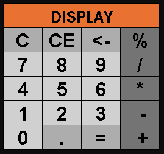

### **Stage 1: Initial Structuring**

- **Define the functionalities of the program:**

Before starting the development of the calculator itself, I took some time to visualize how I want it to look by the end of the project.
This way, I can build the project with a clearer path, knowing its functionalities in advance.
I decided that the main features will be: clear, clear entry, erase, basic arithmetic operations, and floating point support.
While these are simple elements, the main goal of this project is to practice object-oriented programming rather than algorithm complexity.  
To help with visualization, I designed a simple prototype:



- **Define the basic structure of the project:**  
  
Aiming for a well-organized project that makes it easy to implement functionalities and expand in the future, I decided to divide the classes into two main packages: main and operations.

**main:** This package contains the main class of the program, which centralizes the application's control, as well as the class responsible for handling user input and output.

**operations:** This package is dedicated to the classes related to mathematical operations, including the superclass and its specific subclasses for each operation.
Besides providing better visibility and organization of the classes, this structure makes it easier to apply concepts such as inheritance and polymorphism in the future.


### **Stage 2: Class Design and Implementation**

- **Define the main classes:**  

In the main package, the Calculator class will handle the application logic, and UserInterface will manage user input and output.
In the operations package, I made Operator that will serve as a superclass and subclasses for each mathematical operation.

```
src/
  ├── main/
  │    ├── Calculator.java
  │    └── UserInterface.java        
  └── operations/
       ├── Operator.java
       ├── Addition.java
       ├── Subtraction.java
       ├── Multiplication.java
       ├── Division.java
       └── Percentage.java
```

- **Apply encapsulation:**

All class attributes are private, ensuring that they can only be accessed from outside through public methods (getters). This prevents other parts of the code from directly changing values, protecting the data integrity.
In addition, the subclasses of Operator only work with the operands received from the constructor. 